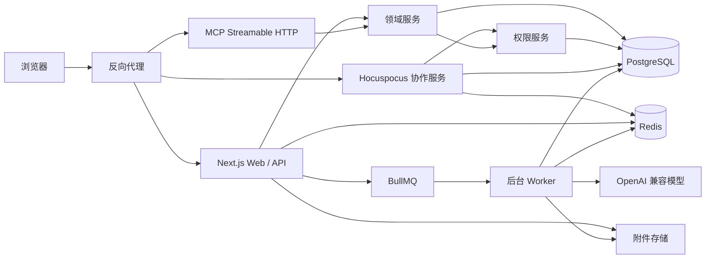
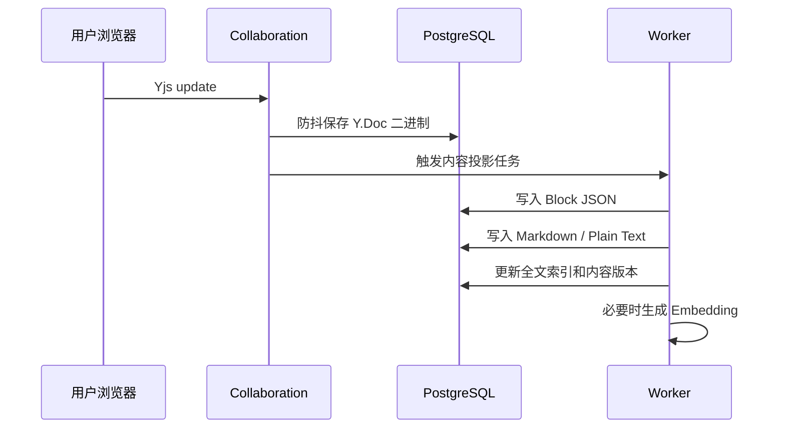

# Seek：技术团队协作知识库技术设计文档

> 文档状态：Draft v0.4  
> 评审日期：待定  
> 创建日期：2026-08-30  
> 目标读者：产品负责人、架构师、前后端开发、测试与运维人员

## 1. 文档目的

本文档定义一个面向算法与软件开发团队的私有化协作知识库的产品边界、技术架构、核心数据模型和实施计划，用作第一阶段开发与技术评审的共同基线。

产品名称为 **Seek**，寓意“探索与求真”。长期定位为一个 **Question Driven** 的团队知识库：团队成员提出的问题将暴露知识缺口，并推动文档持续补全、验证和沉淀。该定位只作为后续演进方向，不扩大当前 MVP 范围。

系统面向最多约 100 人的团队。项目人数不设硬性上限；性能基线是单篇文档的**同时协作编辑人数不超过约 20 人**。产品强调：

- 面向算法、数学和软件研发场景；
- 类似 Notion、Docmost 的块式编辑体验；
- Markdown 是一等导入、导出和互操作格式；
- 支持数学公式、代码块和技术图表；
- 支持多人实时协作、评论和版本恢复；
- 权限、全文搜索、语义搜索、AI 和 MCP 使用统一的访问控制；
- 支持 Docker 私有化部署；
- 不区分社区版、企业版或付费版。

## 2. 已确认的产品决策

| 主题 | 决策 |
|---|---|
| 目标用户 | 算法团队、数学研究人员、软件开发团队 |
| 产品名称 | Seek（探索与求真） |
| 长期定位 | Question Driven：以问题发现、补全和验证团队知识 |
| 团队规模 | 单工作区最多约 100 人 |
| 项目规模 | 不设硬上限；性能基线为单文档同时协作约 20 人 |
| 客户端 | 只考虑桌面 Web，不开发移动端 |
| 部署方式 | Docker 私有化部署 |
| 商业模式 | 当前不考虑付费版或功能分层 |
| 编辑体验 | BlockNote 块式富文本编辑器 |
| Markdown | 一等输入、输出、AI、MCP 和 Git 互操作格式，允许有限有损转换 |
| 数学公式 | LaTeX 语法，BlockNote Math + KaTeX/MathML |
| AI 接口 | 统一使用 OpenAI 兼容接口 |
| 基础设施 | PostgreSQL + Redis |
| 前端 | React + Next.js App Router + shadcn/ui |
| 普通后端 | Next.js Route Handlers 与领域服务 |
| 实时协作 | Yjs + 独立 Hocuspocus WebSocket 服务 |
| 后台任务 | BullMQ Worker |
| MCP | 系统优先作为 MCP Server |

## 3. 非目标范围

第一阶段明确不包含：

- 原生 iOS、Android 或小程序；
- SaaS 多租户计费；
- 社区版、企业版功能差异；
- Notion 式通用数据库、表格视图和看板；
- 完整工作流引擎；
- AI 自主执行高风险写操作；
- MCP Client 自动操作外部系统；
- SAML、SCIM、LDAP 等企业身份能力；
- Kubernetes、多地域容灾和超大规模集群；
- 对任意 Markdown 方言的无损往返承诺。

## 4. 总体架构



### 4.1 运行进程

系统采用同一 TypeScript Monorepo、多个运行进程的方式，不在第一阶段拆成独立业务微服务。

| 进程 | 职责 |
|---|---|
| `web` | Next.js 页面、REST API、认证、普通业务逻辑、AI 流式输出、MCP HTTP |
| `collaboration` | Yjs WebSocket、协作房间、Presence、协作状态加载与持久化 |
| `worker` | 搜索索引、Embedding、版本快照、导入导出、附件处理 |
| `postgres` | 持久化数据、权限、内容、版本、全文与向量检索 |
| `redis` | BullMQ、协作跨实例广播、限流、短期缓存和在线状态 |
| `object-storage` | 图片和附件；开发环境可使用本地卷 |

### 4.2 推荐仓库结构

```text
apps/
├── web/                    # Next.js
├── collaboration/          # Hocuspocus
└── worker/                 # BullMQ Worker

packages/
├── db/                     # Drizzle schema、迁移、数据库连接
├── auth/                   # 身份认证和 Session
├── permissions/            # RBAC/ACL 和权限查询
├── domain/                 # 领域服务
├── editor/                 # BlockNote schema、扩展和 UI
├── markdown/               # Markdown 导入导出
├── search/                 # 全文、模糊、向量检索
├── ai/                     # OpenAI 兼容 ModelGateway
├── mcp/                    # MCP Server
├── storage/                # 本地/S3 兼容附件接口
├── observability/          # 日志、指标、Tracing
├── config/                 # 环境配置与校验
└── test-utils/             # 测试数据库、权限矩阵、固定数据
```

推荐使用 pnpm workspace + Turborepo。

## 5. 技术选型清单

| 领域 | 推荐选型 |
|---|---|
| 语言 | TypeScript，开启 strict mode |
| Runtime | Node.js 22 |
| 前端框架 | React 19、Next.js App Router |
| UI | shadcn/ui、Tailwind CSS v4、Lucide React |
| 表格 | TanStack Table |
| 虚拟列表 | TanStack Virtual |
| 拖拽 | dnd-kit |
| 编辑器 | BlockNote |
| 编辑器 UI | `@blocknote/shadcn` |
| 数学公式 | `@blocknote/math-block`、KaTeX/MathML |
| 代码高亮 | BlockNote code block + Shiki，按需加载语言 |
| 技术图表 | Mermaid |
| 实时协作 | Yjs、Hocuspocus v4 |
| 数据库 | PostgreSQL 17/18 |
| ORM | Drizzle ORM、postgres.js |
| 认证 | Better Auth |
| 应用授权 | 自有 PermissionService |
| 数据库防御 | PostgreSQL Row Level Security |
| 中文全文搜索 | PGroonga |
| 模糊搜索 | pg_trgm |
| 语义搜索 | pgvector |
| 缓存和队列 | Redis、BullMQ |
| AI | Vercel AI SDK + OpenAI Compatible Provider |
| MCP | 官方 MCP TypeScript SDK v2 |
| API 校验 | Zod |
| 对外 API | REST + OpenAPI |
| 单元测试 | Vitest |
| E2E | Playwright |
| 性能测试 | k6 |
| 日志 | Pino |
| 可观测性 | OpenTelemetry、Prometheus 格式指标 |
| 部署 | Docker Compose |
| 反向代理 | Caddy；已有 Nginx 经验时可使用 Nginx |

## 6. 内容模型

### 6.1 内容真源定义

系统不把 Markdown 字符串作为唯一协作状态。内容分为四种表达：

| 表达 | 用途 | 权威程度 |
|---|---|---|
| Y.Doc 二进制 | CRDT 合并、实时协作 | 协作状态真源 |
| BlockNote Block JSON | API、版本比较、静态渲染 | 结构化内容真源 |
| Markdown | 导入导出、AI、MCP、Git 互操作 | 可重建投影 |
| Plain Text | 搜索、摘要和切片 | 可重建投影 |

Markdown 是一等格式，但允许以下变化：

- 列表标记、空行和缩进被规范化；
- 等价的 CommonMark/GFM 写法被统一；
- 部分 HTML 或未知扩展退化为普通文本或约定 HTML；
- 无法表达的 BlockNote 自定义属性可能不出现在标准 Markdown 中。

系统不得静默删除未知内容。无法表达的自定义块应导出为带标识的 HTML 或可恢复占位符。

### 6.2 BlockNote Schema

第一阶段 Block Schema：

- Paragraph
- Heading 1–6
- Bullet List
- Numbered List
- Task List
- Blockquote
- Code Block
- Table
- Image/File
- Divider
- Callout
- Toggle/Details
- Inline Math
- Math Block
- Mermaid Block
- Excalidraw Block（延后到增强阶段，见 6.3）
- User Mention
- Page Mention

建议为每个自定义块实现统一互操作接口：

```typescript
interface BlockInterop<TBlock> {
  toMarkdown(block: TBlock): string;
  fromMarkdown(node: unknown): TBlock | null;
  toPlainText(block: TBlock): string;
  toExternalHTML(block: TBlock): string;
}
```

### 6.3 Excalidraw 图表

Excalidraw 值得支持，但不作为 Phase 0 的阻塞项。

Docmost 已将 Excalidraw 作为编辑器中的图表能力提供，并把它与 Mermaid、Draw.io 一同集成；但其文本协作与 Excalidraw 的实时协作并不是同一条链路。Docmost 社区也将 Excalidraw Live Collaboration 视为需要额外实现的能力。因此，本项目不应把画布实时协作与文档 Yjs 协作混为一谈。

建议采用两阶段方案：

| 阶段 | 范围 | 复杂度 |
|---|---|---|
| 增强阶段 A | BlockNote 自定义 Excalidraw 块、编辑画布、保存场景 JSON、静态预览 SVG/PNG | 中等 |
| 增强阶段 B | 多人同时编辑同一画布、画布 Presence、冲突处理和会话恢复 | 高，不纳入 MVP |

阶段 A 的实现边界：

- BlockNote 块只保存 `diagram_id`、标题和预览元数据；
- 图形元素、应用状态和二进制图片独立存入 `diagrams` / `diagram_files`；
- 保存时生成 SVG 或 PNG 预览，用于只读页面、导出和搜索索引；
- Markdown 导出为 ``，并在 ZIP 导出中同时携带可编辑的 `.excalidraw` 场景文件；
- Markdown 导入的图片只作为图片处理，不承诺从 PNG/SVG 恢复为可编辑画布；
- 编辑器组件通过动态导入加载，查看页面仅渲染预览，避免把大体积画布代码和编辑器初始化带入所有页面；
- 第一阶段不支持 Excalidraw 自带的实时画布协作。

这一方案的集成难度可控；真正难的是将 Excalidraw 的协作、房间管理和身份同步并入现有 Yjs/权限体系。若增强阶段 A 的性能或维护成本不理想，则保持 Mermaid，并以“附件 + SVG/PNG 预览”的形式先提供 Excalidraw 文件嵌入。

### 6.4 Markdown 方言

第一阶段支持：

```text
CommonMark
+ GFM 表格、任务列表、删除线
+ $...$ / $$...$$ 数学公式
+ Mermaid fenced code block
+ GitHub Alerts Callout
+ Obsidian 风格 WikiLink 页面提及
+ 用户提及（具体格式待选）
```

Callout 使用 GitHub Alerts：

```markdown
> [!NOTE]
> 补充说明。

> [!WARNING]
> 生产环境执行前需要确认。
```

渲染层将其映射为 BlockNote Callout；后续如需兼容 Obsidian，可在导入器中额外接受其 `> [!note]` 和可折叠变体，但第一阶段导出保持 GitHub Alerts。

复杂导入流程：


对于 BlockNote 内置 Markdown 解析器无法覆盖的内容，采用 Remark 转 HTML，再调用 `tryParseHTMLToBlocks`。

#### 页面提及：采用 Obsidian 风格 WikiLink

页面提及正式采用 `[[...]]` 语法，以 Markdown 层的双向链接构建知识关联图谱。

```markdown
[[模型部署规范]]
[[模型部署规范|部署规范]]
[[模型部署规范#回滚流程]]
[[模型部署规范#回滚流程|查看回滚说明]]
```

编辑器中输入 `[[` 打开可访问页面的搜索与自动补全；选择页面后，BlockNote 以自定义 Inline Content 保存稳定 `document_id`，并可选保存 `heading_block_id` 和显示别名。Markdown 投影使用页面当前标题生成 WikiLink。

实现要求：

- 页面重命名时，链接语义不变；由稳定 ID 与内容投影自动更新 Markdown 展示文本；
- 标题重复时，UI 必须在候选项中显示所属 Project 和文档路径，导入时不得仅以标题静默绑定；
- `[[目标#标题]]` 在内部解析为目标页面与 Heading Block ID，标题重命名后仍保持关联；
- `[[目标|别名]]` 中的别名不随原页面改名而改变；
- 通过后台投影维护 `document_links(from_document_id, to_document_id, heading_block_id, link_type)`；
- 知识图谱和反向链接只展示当前用户有权读取的节点和边；
- 导出到通用 Markdown 时保留 WikiLink；需要外部兼容时可提供“转换为标准 Markdown 链接”的导出选项。

这种方式与 Obsidian 一致：WikiLink 更简洁，适合作为知识网络的原生表达；内部稳定 ID 则弥补了仅按文件名链接在重名和重命名时的局限。

#### 用户提及：` @用户名`

用户提及不参与知识图谱。编辑器使用 `@` 触发成员搜索，插入后视觉与 Markdown 均表达为普通文本形式：

```markdown
请 @张三 审阅这一节。
```

BlockNote 内部 Mention 节点保存稳定 `user_id`，用于通知、审计和用户改名后的展示更新；Markdown 投影只导出 `@显示名`。纯 Markdown 再次导入时不尝试把 `@显示名` 自动识别为用户提及，避免把普通文本或电子邮件误绑定为成员。

触发规则：

- 只允许在可编辑 Block 的普通文本 Inline Content 中触发，例如段落、标题、列表项、引用和 Callout 的正文；
- 禁止在行内代码、Code Block、行内公式、Math Block、Mermaid、Excalidraw、附件标题、链接 URL 和其他非普通文本节点中触发；
- `@` 前必须是一个实际的空白字符；触发示例为 `请 @张三`，而 `请@张三`、`test@example.com`、`foo@bar` 均作为普通文本；
- Block 起始位置的 `@` 不触发提及；如需提及，必须先输入空格；
- 选择候选成员后，插入 Mention 节点而非仅插入字符串，并保留前导空格；
- 搜索候选时仅展示当前用户有权查看的工作区成员；被禁用或已移除成员不出现在候选中。

### 6.5 内容持久化流程



要求：

- 不能在每次连接时从 Markdown 重新创建 Y.Doc；
- Y.Doc 保存失败时协作服务必须重试并暴露健康状态；
- 内容投影任务必须幂等；
- Y.Doc、Block JSON 和 Markdown 记录相同的内容版本号或内容哈希；
- 搜索和 AI 只消费已完成投影的版本；
- 页面关闭或服务退出时刷新待保存的协作状态。

自动保存策略：

- 有编辑更新时启动空闲计时；连续 **5 秒无编辑**后触发一次保存与内容投影；
- 若用户持续编辑，最晚每 **120 秒**强制尝试一次保存，避免长时间仅存在于内存；
- 用户主动执行“保存版本”时立即持久化；
- WebSocket 断开、浏览器离开、服务优雅退出时尝试刷新待保存状态；
- “保存成功”指 Y.Doc 已持久化；Markdown、搜索和 Embedding 投影允许异步完成并显示状态。

### 6.6 查看模式和编辑模式

查看模式不加载完整协作编辑器：

```text
查看页面
  → 读取 Block JSON
  → 静态只读渲染
  → 不创建 Y.Doc
  → 不连接 WebSocket
```

编辑模式：

```text
进入编辑
  → 检查 document:update 权限
  → 加载 BlockNote 客户端组件
  → 连接 Hocuspocus
  → 获取 Y.Doc 与 Awareness
```

BlockNote 在 Next.js 中作为 client-only 组件动态加载并关闭 SSR。

## 7. 工作区、项目和权限

### 7.1 层级

```text
Workspace
└── Project
    └── Document Tree
        └── Document
```

- Workspace：成员、全局设置和数据隔离边界；
- Project：实际的项目组织与主要授权边界；项目成员数不设硬上限；
- Document：同时是内容单元和文档树节点，通过 `parent_document_id` 组成层级，并支持页面级例外授权。

Phase 1 不引入 Space 或独立 Folder 概念。项目直接拥有一组根文档，每篇文档可继续拥有子文档。同一 Project 内通过 `sort_key` 维护根文档和同级子文档顺序。

### 7.2 角色

工作区角色：

- Owner
- Admin
- Member
- Guest

项目角色：

- Project Admin
- Editor
- Commenter
- Viewer

页面操作：

```text
document:read
document:comment
document:update
document:publish
document:share
document:move
document:delete
document:restore
document:history
```

### 7.3 授权计算

```text
最终权限 = 工作区成员资格
         ∩ 项目成员资格
         + 项目角色基础权限
         + 父文档 / Document ACL 例外
         ∩ 文档状态限制
```

默认拒绝访问。系统必须统一调用：

```typescript
can(actor, "document:read", document)
can(actor, "document:comment", document)
can(actor, "document:update", document)
```

以下入口必须复用同一 PermissionService：

- Next.js 页面加载；
- REST API；
- Hocuspocus 连接与更新；
- 搜索结果；
- AI 检索；
- MCP Resources 和 Tools；
- 附件下载；
- 导出和版本历史。

### 7.4 权限继承规则

第一阶段建议：

- Workspace Admin 默认可以读取所有项目和文档内容；
- 页面默认继承所属 Project 角色和父页面权限；
- 页面级 ACL 可以收紧或扩大父级权限，但不能绕过 Workspace 成员资格；
- 显式拒绝高于显式允许；Workspace Admin 始终可读，Workspace Owner 始终具有管理权限；
- Phase 1 页面 ACL 先支持指定成员；组数据模型保留，组管理 UI 不作为 MVP 阻塞项；
- 不提供跨 Workspace 或跨 Project 的“移动”作为默认操作；
- 跨 Workspace/Project 使用“复制”或“导入”，产生新文档并按目标位置重新计算权限；
- 同一 Project 内在页面树间移动时，必须展示目标权限预览；
- 复制到新位置时默认继承目标位置权限，不复制来源页面的例外 ACL；
- 文档权限变化后立即使权限缓存失效；
- 已连接的 WebSocket 客户端应在短时间内重新验证或断开；
- 无权限内容不能通过标题、搜索建议、评论、附件或 AI 引用泄漏。

### 7.5 RLS

应用层 PermissionService 是主要授权机制，PostgreSQL RLS 作为纵深防御。

- Web 应用使用非 Owner、非超级用户数据库账号；
- 不授予 `BYPASSRLS`；
- 关键内容表启用 RLS；
- 后台 Worker 使用单独角色，并在任务中显式携带作用域；
- 对 RLS 建立独立权限矩阵集成测试。

## 8. 实时协作、评论和版本历史

### 8.1 实时协作

采用 Yjs + Hocuspocus：

开发环境的网络地址解析、文档加载状态机、持久化约束、故障排查和多人验收流程见 [实时协作开发与联调约定](./collaboration-development.md)。

- 每个 Document 对应一个协作房间；
- WebSocket Token 短时有效，绑定用户和文档；
- Hocuspocus `onAuthenticate` 验证读取或编辑权限；
- Awareness 只保存短期在线信息；
- Redis 用于多实例广播，不作为持久化来源；
- PostgreSQL 保存 Y.Doc 二进制。

#### Block 编辑租约

Phase 1 在 Yjs 实时合并之上增加 Block 级协作租约，避免两名用户在正常客户端中同时编辑同一 Block：

- 光标进入可编辑 Block 时申请租约，服务端为同一 Document/Block 只授予一个持有者；
- 其他客户端展示持有者并禁止对该 Block 的内容编辑、删除和移动；
- 持有者编辑或显式续租时更新活动时间；连续 60 秒无编辑或续租则自动释放；
- 持有者失焦、离开文档或 WebSocket 断开时尽快释放，服务端超时作为最终兜底；
- 客户端收到租约丢失事件后立即结束该 Block 的编辑状态；
- Yjs 仍是内容同步与异常合并机制，Block 租约不是持久化内容真源。

### 8.2 评论

评论线程保存在 PostgreSQL，不采用允许客户端直接修改全部评论数据的 Yjs ThreadStore。

建议记录：

```text
document_id
thread_id
author_id
content
status
anchor_block_id
anchor_from
anchor_to
selected_text
context_hash
created_at
updated_at
```

行内评论锚点组合使用：

- Block ID；
- Yjs Relative Position；
- 原始选中文本；
- 前后文哈希。

### 8.3 版本历史

自动保存只持久化实时草稿，不生成版本。只有用户执行“发布”时才生成不可变版本。

发布版本记录版本号、发布人、发布时间和可选发布说明。发布后当前文档继续作为实时草稿编辑，所有有读取权限的用户仍读取当前草稿；发布在 Phase 1 中是版本检查点，不是草稿/线上双视图工作流。

版本数据：

```text
document_id
version
block_json
markdown
plain_text
ydoc_state
published_by
publish_note
published_at
created_at
```

恢复旧版本时不删除后续历史，而是将选中版本的内容写入当前草稿。恢复操作本身不自动发布；用户确认后可再次发布为新版本。

## 9. 搜索

### 9.1 Phase 2 搜索架构

```text
标题与标签模糊搜索   pg_trgm
中文和多语言全文搜索 PGroonga
结构化条件过滤       PostgreSQL
语义搜索             pgvector
结果融合             Reciprocal Rank Fusion
最终权限校验         PermissionService
```

搜索整体延后到 Phase 2，Phase 1 不提供标题、全文或语义搜索功能。Phase 2 不引入 OpenSearch。

### 9.2 搜索文档切片

切片优先按 Block 和标题层级，而不是固定字符数：

```text
Document
├── 标题和摘要
├── Heading Section
│   ├── Paragraph blocks
│   ├── Code block
│   └── Formula block
└── 下一个 Heading Section
```

每个切片包含：

```text
workspace_id
project_id
document_id
content_version
heading_path
block_ids
plain_text
markdown
embedding
```

### 9.3 权限安全

搜索流程：

```text
用户查询
  → 计算可访问 Project/Document 范围
  → 在范围内执行全文/向量检索
  → 合并和排序
  → 对候选结果再次检查权限
  → 返回标题、高亮和摘要
```

禁止先检索所有数据，再只在展示层隐藏无权限结果。

对于当前规模，语义搜索优先采用权限过滤后的精确向量排序；数据量达到阈值后再评估 HNSW，避免近似索引后过滤导致召回不足。

## 10. AI

### 10.1 接口原则

所有模型统一视为 OpenAI 兼容 Provider。系统不在业务逻辑中区分公共云、本地或私有云模型。

Provider 配置：

```text
name
base_url
encrypted_api_key
chat_model
embedding_model
timeout
max_concurrency
capabilities
enabled
```

模型能力单独记录：

```text
supports_streaming
supports_tools
supports_json_schema
supports_embeddings
supports_vision
context_window
embedding_dimensions
```

Provider 配置仅限 Workspace Owner 与 Workspace Admin 管理；Project Admin、Editor、Commenter、Viewer 和 Guest 不得查看、创建、修改或测试 Provider 配置，也不得读取 API Key。其他有 AI 使用权限的角色仅可调用管理员已启用的模型能力。

管理员保存 Provider 后执行兼容性测试。

### 10.2 第一阶段 AI 功能

- 选中文本改写；
- 翻译；
- 页面总结；
- 当前页面问答；
- 跨有权访问文档的知识问答；
- 生成标题和摘要；
- 解释代码或数学公式。

暂不允许 AI 无确认地修改多个页面。

### 10.3 AI 权限流程

```text
用户问题
  → 检查用户身份
  → 计算文档可见范围
  → 权限范围内全文/向量检索
  → 候选结果二次权限校验
  → 组装最少必要上下文
  → 调用 OpenAI 兼容接口
  → 返回答案和来源引用
```

Embedding、Chat 和未来 Reranker 分开配置。Embedding 不得绕过文档访问与删除生命周期。

### 10.4 AI 审计

默认记录：

- 调用人；
- 工作区和项目；
- 功能类型；
- Provider 和模型；
- 输入/输出 Token；
- 引用文档 ID 与版本；
- 状态、耗时和错误码。

默认不保存完整提示词和完整模型响应。

AI 历史读取时必须重新检查其引用文档的当前权限。用户失去任一引用文档的访问权后，不可继续查看包含该文档上下文的会话、消息、引用和缓存结果。

## 11. MCP

第一阶段系统作为 MCP Server，使用官方 TypeScript SDK v2 和 Streamable HTTP。

建议 Resources：

```text
workspace://{workspaceId}/projects
project://{projectId}/documents
document://{documentId}
document://{documentId}/versions
```

建议 Tools：

```text
search_documents
get_document
list_project_documents
create_document
update_document
get_document_versions
```

要求：

- MCP 功能必须先由 Workspace Owner/Admin 在工作区配置中启用，并配置允许的 Tools；
- MCP Token 为额外的、可撤销的凭据，绑定具体用户或服务账号；
- 读写 Scope 分离；
- 每次调用重新计算权限；
- 文档默认以 Markdown 返回；
- 写入 Markdown 时走与普通导入相同的转换管线；
- 工具调用记录审计日志；
- 不提供绕过权限的管理员万能 Token。

## 12. 附件

采用统一 StorageAdapter：

```typescript
interface StorageAdapter {
  put(input: PutObjectInput): Promise<StoredObject>;
  getSignedUrl(key: string, expiresIn: number): Promise<string>;
  delete(key: string): Promise<void>;
}
```

实现：

- 开发环境和默认私有部署：本地持久卷目录；
- S3 兼容对象存储：可选 StorageAdapter；
- Docker Compose 默认不附带对象存储服务；
- 本地卷挂载必须独立于容器生命周期，并纳入备份恢复流程；
- 数据库只保存附件元数据；
- 下载前检查文档权限，再签发短时 URL；
- 校验文件大小、扩展名、声明 MIME 和真实文件类型；
- 图片粘贴自动上传；
- 可选 ClamAV 扫描。

删除与保留策略：

- Workspace、Project、Document 与 Attachment 采用软删除；
- 软删除后保留 **30 天**，期间仅有相应恢复权限的管理员可恢复；
- 到期后由后台任务执行级联硬删除：数据库内容、Y.Doc、版本、搜索切片、向量和本地/S3 附件对象；
- Workspace 删除期间禁止新写入，避免恢复与异步清理产生竞态；
- 硬删除任务需要可重试、可审计，并在附件删除失败时保留失败记录。

## 13. 主要数据表草案

```text
users
sessions

workspaces
workspace_members
groups
group_members

projects
project_members
project_groups

documents
document_permissions

document_collaboration_states
document_contents
document_versions
document_links
document_mentions

comment_threads
comments

attachments
diagrams
diagram_files
audit_logs

search_chunks
ai_providers
ai_models
ai_conversations
ai_messages

mcp_tokens
mcp_audit_logs
```

所有主要业务表应包含：

- UUIDv7 主键；
- `workspace_id`；
- `created_at`、`updated_at`；
- 必要时包含 `created_by`、`updated_by`；
- 软删除内容包含 `deleted_at`、`deleted_by`；
- 乐观锁或内容版本字段。

## 14. API 原则

- REST API 前缀为 `/api/v1`；
- 输入输出使用 Zod 校验；
- 生成 OpenAPI 文档；
- Service 层不依赖 HTTP Request；
- Server Actions 只用于简单 UI 表单；
- AI 使用流式 HTTP；
- 协作使用 WebSocket；
- MCP 使用 Streamable HTTP；
- 所有写操作支持幂等键或明确的并发控制。

示例 API：

```text
POST   /api/v1/auth/login
GET    /api/v1/workspaces/:id
GET    /api/v1/projects/:id/documents
POST   /api/v1/documents
GET    /api/v1/documents/:id
PATCH  /api/v1/documents/:id
DELETE /api/v1/documents/:id
GET    /api/v1/documents/:id/versions
POST   /api/v1/documents/:id/restore
POST   /api/v1/documents/:id/export
POST   /api/v1/search
POST   /api/v1/ai/chat
```

## 15. 缓存和任务队列

Redis 只保存可丢失、可重建或异步数据，不保存唯一业务真源。

BullMQ 任务：

```text
document.project-content
document.index
document.embed
document.import
document.export
attachment.process
permission.reindex
workspace.backup
```

任务要求：

- 参数只传业务 ID，不传完整文档和 API Key；
- 至少一次执行语义；
- Handler 必须幂等；
- 配置重试、指数退避、超时和失败记录；
- 暴露积压、失败和平均耗时指标。

权限缓存键包含权限版本：

```text
permission:{userId}:{documentId}:{permissionVersion}
```

## 16. 安全要求

- Markdown 和 HTML 视为不可信输入；
- 禁止任意 `<script>`、事件属性和 `javascript:` URL；
- Mermaid 使用安全配置；
- 设置 Content Security Policy；
- Session Cookie 使用 HttpOnly、Secure、SameSite；
- 登录、搜索、AI、MCP 和附件接口限流；
- API Key 加密存储且不返回浏览器；
- 日志不得输出密码、Session、API Key 或完整敏感文档；
- 附件使用鉴权和短时链接；
- 用户移出项目后及时断开相关协作连接；
- AI 检索内容明确标记为不可信参考信息；
- 模型不能替代服务端权限判断。

## 17. 可观测性

日志使用 Pino 结构化 JSON，追踪使用 OpenTelemetry。

健康检查：

```text
/health/live
/health/ready
```

主要指标：

- HTTP 请求量、错误率和延迟；
- WebSocket 连接数和协作房间数；
- Y.Doc 加载与持久化耗时；
- PostgreSQL 连接池；
- Redis 状态；
- BullMQ 积压和失败率；
- 内容投影和索引延迟；
- AI 首 Token 延迟与错误率；
- 权限拒绝和异常访问次数。

## 18. Docker 部署

第一阶段 Docker Compose 服务：

```yaml
services:
  proxy:
  web:
  collaboration:
  worker:
  postgres:
  redis:
```

最低要求：

- 镜像版本固定，禁止生产环境使用浮动 `latest`；
- PostgreSQL、附件和必要配置使用持久卷；
- 默认附件目录作为命名持久卷或宿主机挂载；
- 支持可选的外部 PostgreSQL、Redis 和 S3 兼容存储地址；
- 提供数据库迁移命令；
- 提供备份和恢复脚本；
- WebSocket 代理配置包含 Upgrade；
- 支持优雅关闭并刷新协作状态；
- 提供 `.env.example` 和配置校验；
- 可在无外部网络环境启动，AI 功能在未配置时关闭。

## 19. 测试策略

### 19.1 编辑器专项测试

- CommonMark/GFM 导入；
- Markdown → Block → Markdown 往返；
- 公式导入、编辑、导出；
- 代码块中的特殊字符不改变；
- Mermaid 源码不改变；
- 自定义块退化导出；
- 复制粘贴 HTML；
- 大文档只读渲染性能；
- 编辑器卸载后 WebSocket 和 Y.Doc 正确释放。

### 19.2 协作测试

- 两个浏览器同时输入；
- 同时移动和删除块；
- 断网编辑与重连；
- 服务重启后恢复；
- Redis 暂时不可用；
- PostgreSQL 暂时不可用；
- Viewer 尝试发送写更新；
- 用户编辑过程中被移出项目。

### 19.3 权限测试

使用权限矩阵覆盖：

```text
角色 × 工作区 × 项目 × 父文档继承 × 文档例外 × 操作
```

必须验证页面、搜索、AI、MCP、附件、评论和版本历史结果一致。

### 19.4 性能目标草案

在单工作区 100 人、项目人数不设硬上限、单篇文档同时协作约 20 人的性能基线下：

- 普通页面首屏读取 P95 < 500 ms，不含网络环境差异；
- 搜索 P95 < 800 ms；
- 协作更新正常网络下可感知延迟 < 200 ms；
- 只读页面不初始化完整 Yjs/Hocuspocus；
- 1 MB Markdown 等价内容可编辑，但需要单独进行性能验证；
- 单协作房间约 20 人持续编辑稳定运行。

这些数值在原型性能测试后重新确认。

## 20. 实施阶段

### Phase 0：技术垂直切片

目标：消除编辑器和协作链路的最大技术风险。

- Next.js + shadcn/ui 页面壳；
- BlockNote + `@blocknote/shadcn`；
- 数学公式、代码块和 Mermaid；
- Yjs + Hocuspocus；
- PostgreSQL 保存 Y.Doc；
- Block JSON、Markdown 和 Plain Text 投影；
- 两人协作、断网重连和版本恢复 Demo；
- Markdown 往返测试语料库。

### Phase 1：可用知识库 MVP

- 登录、邀请和工作区；
- 项目和项目成员；
- 文档树和拖拽；
- 基础 RBAC/ACL；
- 实时协作；
- 评论；
- 实时草稿、发布版本和恢复；
- 附件；
- Markdown 导入导出；
- Docker Compose。

### Phase 2：AI 与语义搜索

- 标题模糊搜索和 PGroonga 全文搜索；
- 搜索权限预过滤、结果二次校验和结构化筛选；
- OpenAI 兼容 Provider；
- 页面总结、改写、翻译；
- 当前页面问答；
- pgvector 和跨文档问答；
- 来源引用；
- AI 审计。

### Phase 3：MCP 与增强能力

- MCP Server；
- 用户/API Token Scope；
- Markdown 读写工具；
- 页面提及、反向链接；
- 模板和文档评审状态。
- Excalidraw 阶段 A：可编辑画布与静态预览。

### Phase 4：Question Driven 知识演进（长期方向）

Seek 的长期价值不只是存放文档，而是用团队问题推动知识持续演进。该阶段在当前权限、搜索、AI 和版本基础稳定后再考虑：

- 问题收集箱：用户把未解决问题提交到具体 Project 或 Document；
- 问题与文档关联：标记现有文档已回答、部分回答或缺少知识；
- 基于权限范围的相似问题与已有答案推荐；
- AI 根据有权访问的资料生成“待验证回答草案”，且始终附带来源；
- 将已确认回答转化为文档补充建议，由人审阅后写入；
- 问题关闭、过期、归档和知识缺口统计；
- 以 WikiLink、反向链接和问题关联共同构成可权限过滤的知识图谱。

不在此阶段之前让 AI 自动修改团队文档，也不把“提问”变成绕过正式文档评审的旁路。

## 21. Phase 0 验收条件

满足以下条件后再开始大规模业务开发：

- BlockNote 与 shadcn/ui 样式可以统一；
- 行内和块级公式可输入、渲染和导出；
- CommonMark/GFM 核心语料可稳定导入导出；
- 代码块内容在往返后完全一致；
- 两名用户可实时编辑同一页面；
- 断网重连后无内容丢失或重复；
- Hocuspocus 重启后可从 PostgreSQL 恢复；
- Y.Doc 可稳定投影为 Block JSON、Markdown 和 Plain Text；
- 旧版本可恢复为新的当前版本；
- Viewer 无法通过 WebSocket 修改内容；
- 查看模式不加载完整协作栈；
- 复杂页面切换没有明显主线程冻结。

## 22. 已确认决策与待选择项

### 已确认

| 主题 | 决策 |
|---|---|
| Workspace Admin | 默认可读取所有项目和文档内容 |
| Document ACL | 可收紧或扩大父级权限 |
| 内容层级 | Workspace → Project → Document Tree；不引入 Space |
| 跨项目/工作区内容迁移 | 不提供默认“移动”；使用复制或导入，目标文档重新计算权限 |
| 页面级 ACL | 纳入 MVP |
| 匿名公开分享 | 当前不考虑 |
| 原始 HTML | 当前不允许 |
| Callout | GitHub Alerts；未来导入兼容 Obsidian 变体 |
| 页面提及 | Obsidian 风格 WikiLink：`[[页面]]`、`[[页面#标题]]`、`[[页面|别名]]`；用于反向链接和知识图谱 |
| 用户提及 | ` @用户名`；仅普通文本层级、前置空格后触发；Markdown 导出为 `@显示名` |
| 公式编号和交叉引用 | 第一阶段不考虑 |
| Git 同步 | 当前不考虑 |
| 中文全文搜索 | PGroonga |
| 存储 | 默认本地持久卷；S3 兼容存储可选；Compose 默认不附带对象存储 |
| 自动保存 | 空闲 5 秒触发；持续编辑最长 120 秒强制尝试一次 |
| 发布与版本 | 自动保存只保存实时草稿；只有手动发布才生成不可变版本 |
| Block 编辑租约 | 同一 Block 同时仅一名持有者；连续 60 秒无活动自动释放 |
| Phase 1 搜索 | 不实现，标题、全文和语义搜索统一移到 Phase 2 |
| AI 权限失效 | 用户失去文档权限后不可查看涉及该文档的 AI 历史内容 |
| MCP 写操作 | 需额外 Token，且由管理员进行 MCP 服务和 Tool 配置 |
| 删除保留期 | Workspace、Project、Document、Attachment 软删除保留 30 天 |

当前无阻塞性待选择项。

## 23. 主要风险

| 风险 | 影响 | 缓解措施 |
|---|---|---|
| BlockNote 自定义块无法合理导出 Markdown | 数据互操作下降 | 为每种块定义导出和退化规则 |
| Y.Doc、Block JSON、Markdown 投影不一致 | 搜索或版本内容过期 | 内容版本号、哈希、幂等投影和监控 |
| 权限逻辑分散 | 越权访问 | 统一 PermissionService + RLS + 权限矩阵测试 |
| 页面切换初始化编辑器卡顿 | 使用体验差 | 静态只读模式、延迟加载、性能基准 |
| 向量检索后过滤导致召回不足 | AI 答案缺少资料 | 权限预过滤、初期精确检索、结果二次校验 |
| AI 或 MCP 泄漏无权限内容 | 严重安全问题 | 所有入口复用权限服务并记录审计 |
| Redis 被当成持久化来源 | 数据丢失 | PostgreSQL 保存全部业务真源 |
| 私有部署升级失败 | 数据不可用 | 固定版本、迁移测试、备份恢复流程 |

## 24. 参考资料

- BlockNote Markdown：<https://www.blocknotejs.org/docs/features/import/markdown>
- BlockNote Math：<https://www.blocknotejs.org/docs/features/blocks/math>
- BlockNote shadcn/ui：<https://www.blocknotejs.org/docs/getting-started/shadcn>
- BlockNote Collaboration：<https://www.blocknotejs.org/docs/features/collaboration>
- Docmost Editor：<https://docmost.com/docs/user-guide/editor>
- Docmost Excalidraw 协作讨论：<https://github.com/docmost/docmost/issues/315>
- Obsidian Internal Links：<https://obsidian.md/help/links>
- Typora Links：<https://support.typora.io/Links/>
- Hocuspocus Persistence：<https://tiptap.dev/docs/hocuspocus/guides/persistence>
- Hocuspocus Database Extension：<https://tiptap.dev/docs/hocuspocus/server/extensions/database>
- Hocuspocus Redis Extension：<https://tiptap.dev/docs/hocuspocus/server/extensions/redis>
- PostgreSQL Row Security：<https://www.postgresql.org/docs/17/ddl-rowsecurity.html>
- PostgreSQL pg_trgm：<https://www.postgresql.org/docs/17/pgtrgm.html>
- PGroonga：<https://pgroonga.github.io/reference/>
- pgvector：<https://github.com/pgvector/pgvector>
- MCP TypeScript SDK：<https://ts.sdk.modelcontextprotocol.io/v2/>
- Docmost：<https://github.com/docmost/docmost>

---

评审建议：优先检查第 2、6、7、9、10、20、21、22 节；当前无阻塞性待选择项。
